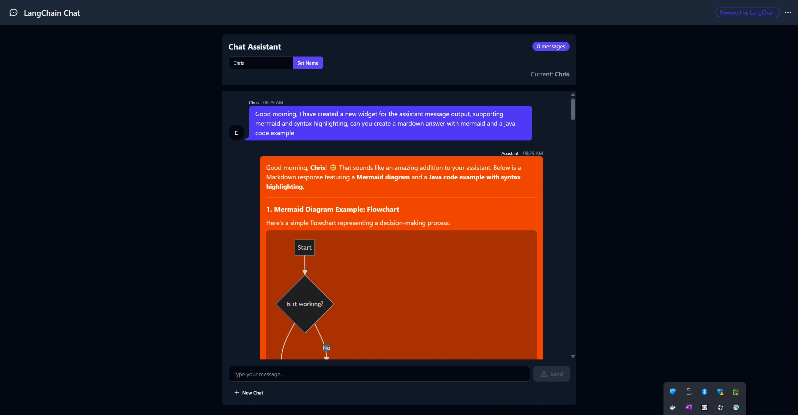
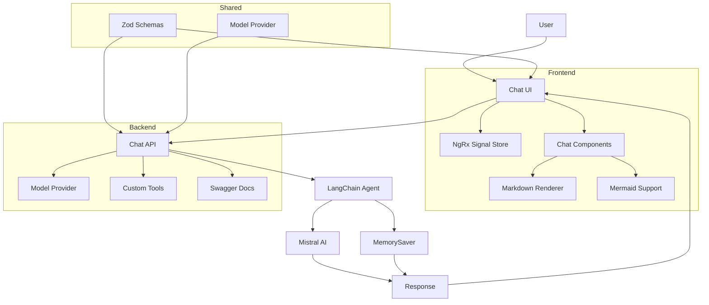
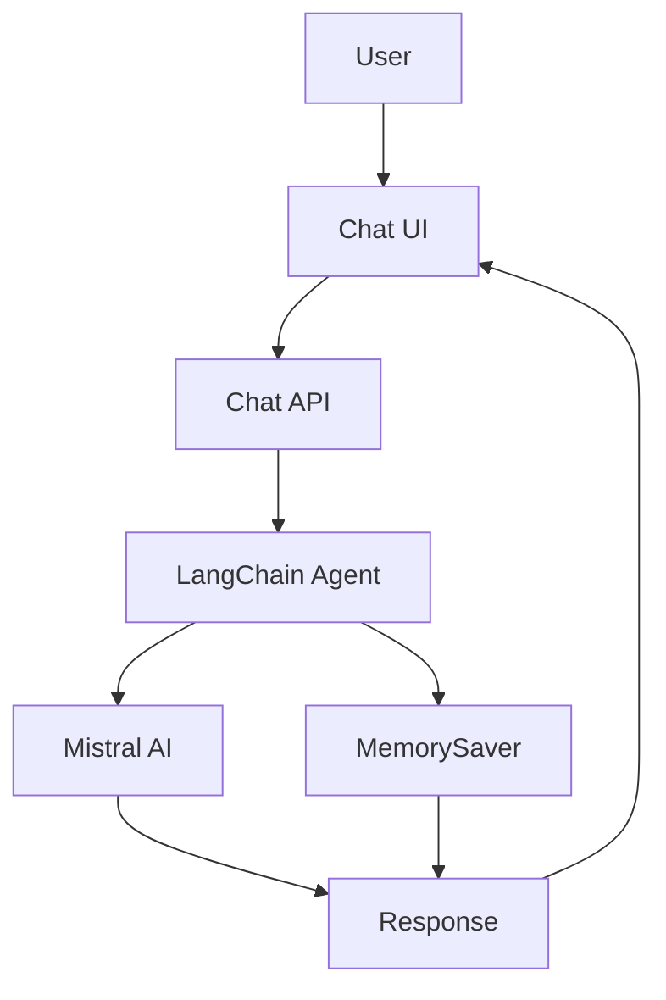

# LangChain Course Workspace

Welcome to the **LangChain Course Workspace**, a comprehensive monorepo showcasing a full-stack AI-powered chat application. This project demonstrates the integration of modern web technologies with advanced AI orchestration using LangChain and LangGraph.

<a alt="Nx logo" href="https://nx.dev" target="_blank" rel="noreferrer"></a>

---

## 🚀 Overview

This repository is built as an [Nx workspace](https://nx.dev) and contains a suite of applications and libraries designed to provide a seamless multi-turn conversation experience. It leverages **NestJS** for the backend, **AnalogJS/Angular** for the frontend, and **LangChain/LangGraph** for AI logic.

### Key Features
- **Multi-turn Conversations**: Context-aware chat with memory persistence using LangGraph.
- **AI Orchestration**: Advanced agent logic with LangChain, featuring custom tools for personalization.
- **E-Commerce Agent** (In Development): Building an intelligent e-commerce assistant with product knowledge powered by vector embeddings.
- **Reactive Frontend**: A modern UI built with Angular Signals and NgRx Signal Store.
- **Type-Safe API**: Shared Zod schemas for end-to-end type safety between the UI and API.
- **MistralAI Integration**: Dedicated model provider library for Mistral AI services.
- **Rich Content Rendering**: Support for markdown, code syntax highlighting, and Mermaid diagrams.



---

## 🏗️ Project Structure

The workspace is organized into several applications and libraries:

### Applications
- **`chat-api` (`apps/chat-api`)**: A NestJS backend providing the AI chat logic.
  - Implements LangGraph `MemorySaver` for conversation threading.
  - Custom LangChain tools for user personalization.
  - Swagger UI for interactive API documentation.
  - 📖 [Detailed Documentation](apps/chat-api/README.md)

- **`chat-ui` (`apps/chat-ui`)**: An AnalogJS/Angular frontend.
  - Uses NgRx Signal Store for reactive state management.
  - Shared Zod schemas for validation and type safety.
  - Proxy-based integration with the backend.
  - Includes comprehensive service documentation for the chat store.

- **`hello-agent` (`apps/hello-agent`)**: A CLI tool built with Nest Commander for quick AI interactions.

- **`product-ingest` (`apps/product-ingest`)**: An embedding pipeline for e-commerce product data.
  - Processes product catalogs and generates vector embeddings for semantic search.
  - First step in building an intelligent e-commerce agent.
  - Integrates with vector databases for efficient product knowledge retrieval.
  - 📖 [Detailed Documentation](apps/product-ingest/README.md)

- **`ecommerce-assistant-api` (`apps/ecommerce-assistant-api`)**: A conversational e-commerce assistant API.
  - Semantic product search using pgvector and LangChain.
  - Multi-turn conversations with memory persistence.
  - Custom LangChain tools for product search and category browsing.
  - Structured responses with Markdown support.
  - Swagger UI for interactive API documentation.
  - 📖 [Detailed Documentation](apps/ecommerce-assistant-api/README.md)

### Infrastructure
- **`iac` (`iac/`)**: Infrastructure as Code for deployment and vector database setup.
  - 📖 [Infrastructure Documentation](iac/README.md)

### Libraries
- **`chat-components` (`libs/chat-components`)**: Reusable Angular UI components (message bubbles, markdown rendering).
  - 📖 [Detailed Documentation](libs/chat-components/README.md)
  - Features markdown rendering with syntax highlighting.
  - Supports Mermaid diagram visualization.
  - Optimized for performance and accessibility.

- **`model-provider` (`libs/model-provider`)**: A shared library for MistralAI configuration and integration.
  - 📖 [Detailed Documentation](libs/model-provider/README.md)
  - Provides centralized Mistral AI model management.
  - Supports both synchronous and asynchronous configuration.
  - Enables dependency injection across the workspace.

---

## 🛠️ Tech Stack

- **Frameworks**: [Nx](https://nx.dev), [NestJS](https://nestjs.com/), [Angular](https://angular.io/) (via [AnalogJS](https://analogjs.org/))
- **AI Logic**: [LangChain](https://js.langchain.com/), [LangGraph](https://langchain-ai.github.io/langgraphjs/)
- **State Management**: NgRx Signal Store
- **Styling**: Tailwind CSS, DaisyUI
- **Validation**: Zod, class-validator
- **Database/Memory**: LangGraph Checkpointers (In-memory)
- **API Documentation**: Swagger/OpenAPI

## 🏛️ Architecture Overview



### Data Flow
1. **User Interaction**: User sends a message through the chat interface
2. **State Management**: NgRx Signal Store manages conversation state
3. **API Request**: Chat UI sends request to NestJS backend
4. **AI Processing**: LangChain agent processes request with context from MemorySaver
5. **Model Integration**: Mistral AI generates response using the configured model
6. **Response Handling**: Backend returns structured response with conversation context
7. **Content Rendering**: Chat UI displays response with markdown, code highlighting, and diagrams

---

## 🛍️ E-Commerce Agent Initiative

This workspace includes an intelligent e-commerce assistant that helps users discover and recommend products based on natural language queries.

### Current Progress
✅ **Product Embedding Pipeline**: The `product-ingest` application processes e-commerce product catalogs and generates vector embeddings, enabling semantic search capabilities.

✅ **E-Commerce Assistant API**: A fully functional conversational API built with NestJS, LangChain, and pgvector:
  - **Semantic Product Search**: Uses vector similarity to find relevant products from natural language queries
  - **Multi-turn Conversations**: Maintains context across multiple messages using LangGraph MemorySaver
  - **LangChain Tools**: Custom tools for product search (with optional category filtering) and category listing
  - **Structured Responses**: Consistent JSON format with AI-generated summaries and product data
  - **Markdown Support**: Rich text formatting for better readability
  - **RESTful API**: Three endpoints (POST, PUT, DELETE) with comprehensive Swagger documentation

### Roadmap
- 🔄 Integration with the existing chat interface
- 🔄 Advanced features: filtering by price/rating, product comparison, and personalized recommendations
- 🔄 Dynamic category detection from database
- 🔄 Shopping cart management

See the [E-Commerce Assistant API Documentation](apps/ecommerce-assistant-api/README.md), [Product Ingest Documentation](apps/product-ingest/README.md), and [Infrastructure Documentation](iac/README.md) for more details on the technical implementation.

---

## 🚦 Getting Started

### Prerequisites
- Node.js (v18+)
- npm or yarn
- A Mistral AI API Key

### Installation

1. Clone the repository:
   ```sh
   git clone <repository-url>
   cd langchain-course-ws
   ```

2. Install dependencies:
   ```sh
   npm install
   ```

3. Set up environment variables:
   Create a `.env` file in the root directory and add your Mistral API key:
   ```env
   MISTRAL_API_KEY=your_api_key_here
   ```

### Running the Application

You can run both the frontend and backend simultaneously using Nx:

```sh
# Start both chat-api and chat-ui
npm run dev
```

Alternatively, run them individually:
```sh
# Start Backend (API)
npm run chat-api:dev

# Start Frontend (UI)
npm run chat-ui:dev
```

### Using the CLI Agent
```sh
npm run hello-agent:dev -- chat "Hello, how are you?"
```

---

## 🧪 Testing

The workspace uses Vitest for unit testing and Playwright for E2E testing.

```sh
# Run all tests
npx nx run-many -t test

# Run specific project tests
npm run chat-api:test
npm run chat-ui:test
npm run chat-components:test
```

---

## 🔧 Useful Nx Commands

- **Visual Graph**: `npx nx graph` - See how projects depend on each other.
- **Generate Code**: `npx nx g @nx/angular:component my-component --project=chat-ui`
- **Linting**: `npx nx run-many -t lint`

---

## 📖 Documentation & Links

### Project Documentation
- 📖 [Chat API Documentation](apps/chat-api/README.md)
- 📖 [E-Commerce Assistant API Documentation](apps/ecommerce-assistant-api/README.md)
- 📖 [Product Ingest Pipeline](apps/product-ingest/README.md)
- 📖 [Chat Components Library](libs/chat-components/README.md)
- 📖 [Model Provider Library](libs/model-provider/README.md)
- 📖 [Infrastructure Documentation](iac/README.md)

### Technology Documentation
- [Nx Documentation](https://nx.dev)
- [LangChain JS Docs](https://js.langchain.com/)
- [LangGraph JS Docs](https://langchain-ai.github.io/langgraphjs/)
- [AnalogJS Docs](https://analogjs.org/)
- [NgRx Signal Store](https://ngrx.io/guide/signal-store)
- [Zod Validation](https://zod.dev/)

### Rich Content Features
This project supports advanced content rendering including:
- **Markdown**: Headers, lists, tables, and formatting
- **Code Syntax Highlighting**: Automatic highlighting for dozens of programming languages
- **Mermaid Diagrams**: Interactive flowcharts, sequence diagrams, and more
- **Responsive Design**: Optimized for desktop and mobile devices

### Example Mermaid Diagram


Made with ❤️ as part of the LangChain Course.
