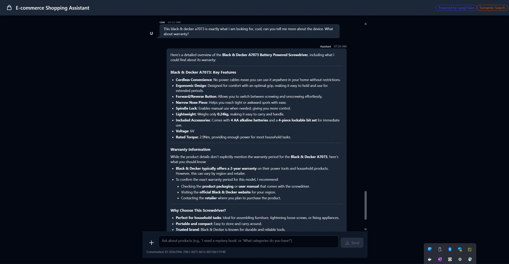

# Shopping Assistant UI



## 🛍️ Overview

The **Shopping Assistant UI** is a modern web application designed to demonstrate the power of AI in e-commerce. It serves as a conversational interface where users can ask for product recommendations, compare items, and get personalized assistance.

This project is part of my learning journey with **Nx**, **LangChain**, and **LangGraph**, focusing on how to build intelligent, context-aware applications. The goal is to create an engaging user experience that seamlessly integrates with backend AI services.

## ✨ Features

- **Conversational Interface**: A chat-based UI for natural interactions.
- **Product Recommendations**: Displays product cards with details relevant to the user's query.
- **Rich Content**: Supports Markdown rendering for structured text and lists.
- **State Management**: Built with **NgRx Signal Store** for reactive and efficient state handling.
- **Session Management**: Handles conversation persistence and history.

## 🛠️ Tech Stack

- **Framework**: [Angular](https://angular.io/) / [AnalogJS](https://analogjs.org/)
- **State Management**: [NgRx Signal Store](https://ngrx.io/guide/signal-store)
- **Styling**: Tailwind CSS (presumed based on workspace conventions)
- **API Integration**: Connects to the `ecommerce-assistant-api` backend.

## 🚀 Getting Started

This application is part of the Nx workspace. You can serve it using:

```bash
npx nx serve ecommerce-assistant-ui
```

Explore the code to see how the frontend interacts with the AI agent to provide a smart shopping experience!
