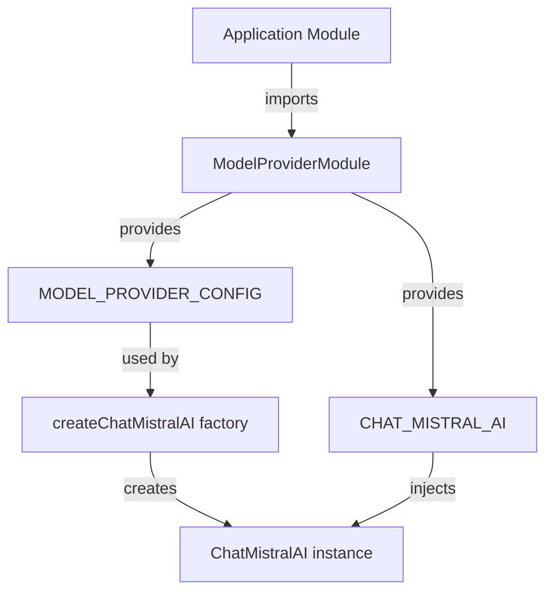

# 🤖 Model Provider Library

**A shared NestJS module for Mistral AI integration using LangChain**

This library provides a centralized configuration and dependency injection system for Mistral AI's ChatMistralAI model across the entire Nx workspace. It enables consistent AI model usage with configurable parameters.

## 🎯 Purpose

The `model-provider` library serves as a **shared infrastructure layer** that:

- ✅ Provides a single source of truth for Mistral AI configuration
- ✅ Enables dependency injection of pre-configured ChatMistralAI instances
- ✅ Supports both synchronous and asynchronous configuration
- ✅ Ensures consistent model behavior across all applications
- ✅ Reduces boilerplate code for AI model initialization

## 🔧 Features

### 1. **Configurable Mistral AI Integration**
- Model selection (`mistral-large-latest` by default)
- Temperature control (0.2 by default for deterministic responses)
- API key management via environment variables

### 2. **Dependency Injection Ready**
- Seamless integration with NestJS applications
- Global module registration for workspace-wide access
- Type-safe configuration interfaces

### 3. **Flexible Configuration**
- Synchronous configuration support
- Asynchronous configuration with factory pattern
- Dependency injection for configuration providers

## 🚀 Quick Start

### Installation

The library is already included in your Nx workspace. No additional installation is needed.

### Basic Usage

```typescript
import { ModelProviderModule } from '@langchain-course-ws/model-provider';
import { ConfigService } from '@nestjs/config';

@Module({
  imports: [
    ModelProviderModule.forRootAsync({
      useFactory: async (configService: ConfigService) => ({
        apiKey: configService.get<string>('MISTRAL_API_KEY') || '',
        model: 'mistral-large-latest',
        temperature: 0.7,
      }),
      inject: [ConfigService],
    }),
  ],
})
export class AppModule {}
```

### Injecting the ChatMistralAI Instance

```typescript
import { Injectable } from '@nestjs/common';
import { CHAT_MISTRAL_AI } from '@langchain-course-ws/model-provider';

@Injectable()
export class ChatService {
  constructor(@Inject(CHAT_MISTRAL_AI) private readonly model: ChatMistralAI) {}

  async generateResponse(prompt: string): Promise<string> {
    const result = await this.model.invoke([
      new HumanMessage(prompt)
    ]);
    return result.content;
  }
}
```

## 📦 API Reference

### Configuration Interfaces

#### `ModelProviderConfig`
```typescript
export interface ModelProviderConfig {
  apiKey: string;          // Required: Mistral AI API key
  model?: string;          // Optional: Model name (default: 'mistral-large-latest')
  temperature?: number;    // Optional: Temperature (default: 0.2)
}
```

#### `ModelProviderAsyncConfig`
```typescript
export interface ModelProviderAsyncConfig extends Pick<ModuleMetadata, 'imports'> {
  useFactory: (...args: any[]) => Promise<ModelProviderConfig> | ModelProviderConfig;
  inject?: any[];
}
```

### Constants

```typescript
// Injection tokens
export const MODEL_PROVIDER_CONFIG = 'MODEL_PROVIDER_CONFIG';
export const CHAT_MISTRAL_AI = 'CHAT_MISTRAL_AI';

// Default values
export const DEFAULT_MODEL = 'mistral-large-latest';
export const DEFAULT_TEMPERATURE = 0.2;
```

### Module Methods

#### `ModelProviderModule.forRootAsync(options: ModelProviderAsyncConfig)`

**Parameters:**
- `options.imports`: Array of modules to import
- `options.useFactory`: Factory function that returns ModelProviderConfig
- `options.inject`: Array of dependencies to inject into the factory

**Returns:** `DynamicModule` - Configured NestJS module

## 🏗️ Advanced Configuration

### Environment-Based Configuration

```typescript
// app.module.ts
import { ConfigModule, ConfigService } from '@nestjs/config';

@Module({
  imports: [
    ConfigModule.forRoot(),
    ModelProviderModule.forRootAsync({
      imports: [ConfigModule],
      useFactory: async (configService: ConfigService) => ({
        apiKey: configService.get<string>('MISTRAL_API_KEY') || '',
        model: configService.get<string>('MISTRAL_MODEL') || 'mistral-large-latest',
        temperature: parseFloat(configService.get<string>('MISTRAL_TEMPERATURE') || '0.2'),
      }),
      inject: [ConfigService],
    }),
  ],
})
export class AppModule {}
```

### Multiple Model Configurations

You can create multiple instances with different configurations:

```typescript
// Create a creative model instance
const creativeModel = new ChatMistralAI({
  apiKey: config.apiKey,
  model: 'mistral-large-latest',
  temperature: 0.9, // High creativity
});

// Create a deterministic model instance
const deterministicModel = new ChatMistralAI({
  apiKey: config.apiKey,
  model: 'mistral-large-latest',
  temperature: 0.1, // Low creativity
});
```

## 🔍 Technical Details

### Architecture



### Dependency Injection Flow

1. **Module Registration**: `ModelProviderModule.forRootAsync()` registers the module
2. **Configuration Provider**: Creates a provider for `MODEL_PROVIDER_CONFIG` using the factory
3. **Model Provider**: Creates a provider for `CHAT_MISTRAL_AI` that depends on the config
4. **Factory Execution**: `createChatMistralAI()` creates the actual ChatMistralAI instance
5. **Global Export**: The `CHAT_MISTRAL_AI` token is exported globally for workspace-wide use

### Memory Management

The library uses NestJS's dependency injection system, which means:
- ✅ **Singleton by default**: The ChatMistralAI instance is created once and reused
- ✅ **Lazy initialization**: The model is only instantiated when first injected
- ✅ **Automatic cleanup**: NestJS handles resource cleanup on application shutdown

## 🧪 Testing

### Unit Testing

```typescript
import { Test } from '@nestjs/testing';
import { CHAT_MISTRAL_AI } from '@langchain-course-ws/model-provider';
import { ChatMistralAI } from '@langchain/mistralai';

describe('ModelProviderModule', () => {
  it('should provide ChatMistralAI instance', async () => {
    const module = await Test.createTestingModule({
      imports: [
        ModelProviderModule.forRootAsync({
          useFactory: async () => ({
            apiKey: 'test-api-key',
            model: 'mistral-large-latest',
            temperature: 0.2,
          }),
        }),
      ],
    }).compile();

    const model = module.get<ChatMistralAI>(CHAT_MISTRAL_AI);
    expect(model).toBeInstanceOf(ChatMistralAI);
  });
});
```

### Mocking for Tests

```typescript
// In your test files
const mockModel = {
  invoke: jest.fn().mockResolvedValue({ content: 'mock response' }),
  // Add other methods as needed
};

beforeEach(() => {
  TestBed.configureTestingModule({
    providers: [
      { provide: CHAT_MISTRAL_AI, useValue: mockModel },
    ],
  });
});
```

## 📚 Best Practices

### 1. **Environment Variables**

Always use environment variables for sensitive data:

```env
# .env file
MISTRAL_API_KEY=your_api_key_here
MISTRAL_MODEL=mistral-large-latest
MISTRAL_TEMPERATURE=0.2
```

### 2. **Error Handling**

Wrap model calls in try-catch blocks:

```typescript
try {
  const response = await this.model.invoke([new HumanMessage(prompt)]);
  return response.content;
} catch (error) {
  this.logger.error('AI model error:', error);
  throw new InternalServerErrorException('Failed to generate AI response');
}
```

### 3. **Rate Limiting**

Consider implementing rate limiting for production use:

```typescript
// Use a rate limiter library or implement your own
const rateLimiter = new RateLimiter({ tokensPerInterval: 10, interval: 'minute' });

async function generateWithRateLimit(prompt: string) {
  await rateLimiter.removeTokens(1);
  return this.model.invoke([new HumanMessage(prompt)]);
}
```

### 4. **Model Selection**

Choose the right model for your use case:

- **`mistral-large-latest`**: Best for complex reasoning and tool calling
- **`mistral-medium-latest`**: Good balance of speed and quality
- **`mistral-small-latest`**: Fastest, good for simple tasks

## 🔗 Related Documentation

- [Mistral AI API Documentation](https://docs.mistral.ai/)
- [LangChain JS Documentation](https://js.langchain.com/)
- [NestJS Dependency Injection](https://docs.nestjs.com/fundamentals/custom-providers)
- [Nx Shared Libraries Guide](https://nx.dev/guides/shared-libraries)

## 📋 Changelog

### v1.0.0
- Initial release with basic Mistral AI integration
- Async configuration support
- Global module registration

### v1.1.0 (Planned)
- Support for multiple model providers
- Error handling utilities
- Rate limiting integration
- Usage metrics and monitoring

## 🤝 Contributing

This library is part of the langchain-course-ws monorepo. Contributions are welcome!

### Development Workflow

```bash
# Build the library
nx build model-provider

# Run tests
nx test model-provider

# Lint the code
nx lint model-provider
```

### Adding New Features

1. Update the configuration interfaces if needed
2. Extend the factory function
3. Add new providers to the module
4. Update documentation
5. Write tests

## 📝 License

This library is licensed under the MIT License. See the [workspace license](../LICENSE) for details.
